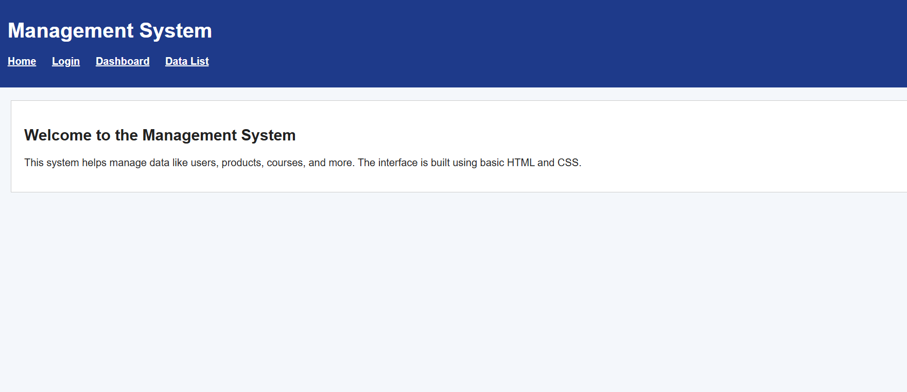
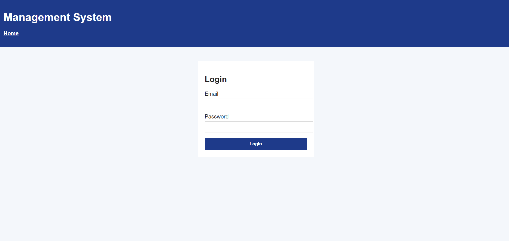
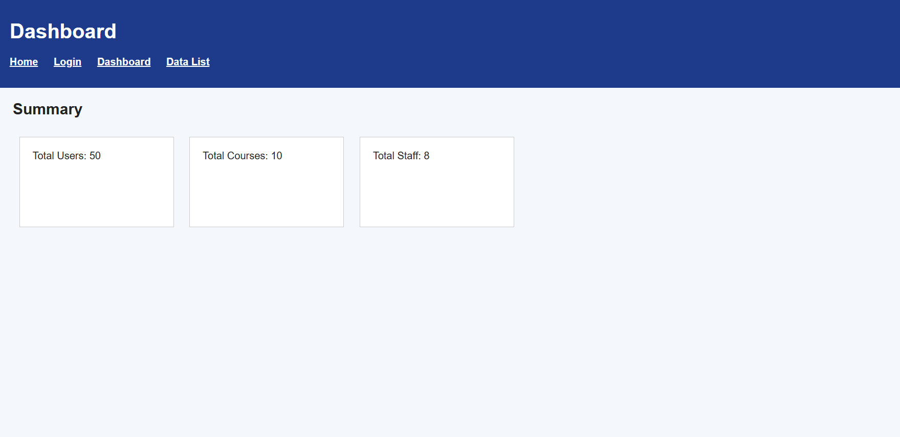
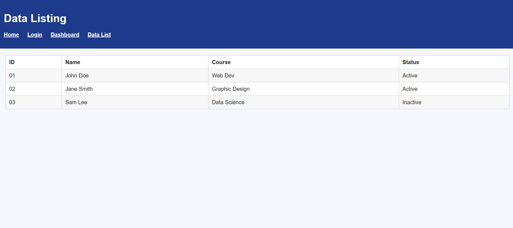

# Static Management System Web Interface

## Assignment Title
**HTML & CSS Fundamentals – Static Web Page Design**

## Project Description
This project is a static web interface for a management system built using only basic HTML and CSS. It simulates a real management system layout without any backend or JavaScript. The interface includes navigation between multiple pages and demonstrates the use of semantic HTML elements, tables, forms, and basic styling.

## Pages Included
The project contains the following pages:

1. **Home Page (`index.html`)**
   - Header with application title
   - Navigation menu using an unordered list
   - Introduction section describing the system
   - Footer with copyright information

2. **Login Page (`login.html`)**
   - Login form with labels and inputs
   - Submit button
   - Simple centered layout using width and margin

3. **Dashboard Page (`dashboard.html`)**
   - Page heading
   - Summary boxes for total users, courses, and staff
   - Inline-block elements used to align summary boxes

4. **Data Listing Page (`list.html`)**
   - Table displaying sample data
   - Proper table headers
   - Alternating row colors

## Technologies Used
- HTML5
- CSS3 (Basic styling only)

## Folder Structure
project-folder/
│
├── index.html
├── login.html
├── dashboard.html
├── list.html
│
├── css/
│ └── style.css
│
└── images/

## Features Implemented
- Semantic HTML structure using header, nav, section, and footer
- External CSS file for styling
- Navigation links between pages using anchor tags
- Use of tables for data listing
- Basic hover effects for navigation and buttons
- Styled summary boxes using inline-block elements
- Alternating row colors in the data table

## Screenshots

1. Home Page
2. Login Page
3. Dashboard Page
4. Data Listing Page

## How to Run
1. Download or clone the repository.
2. Open `index.html` in a web browser.
3. Use navigation links to move between pages.
