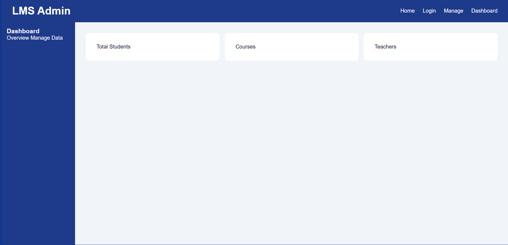
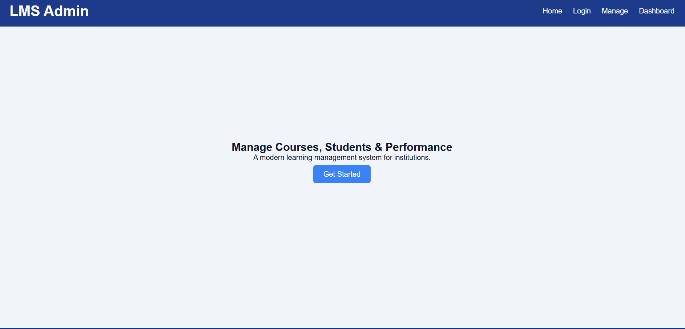
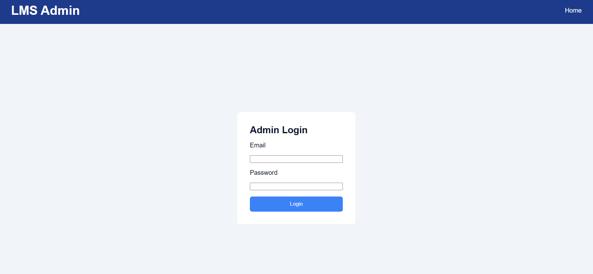
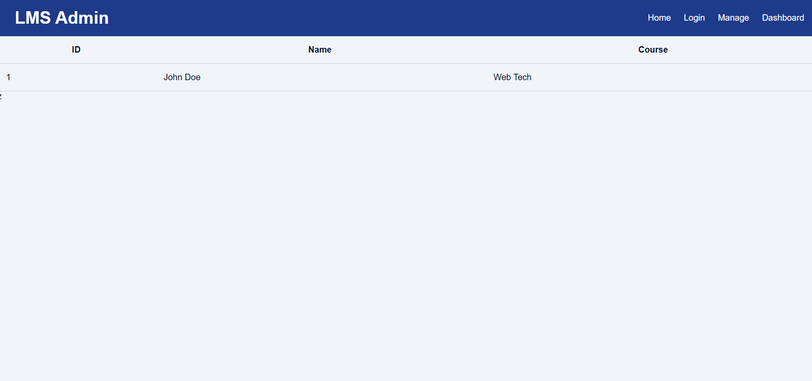

# Responsive Management System Interface

## Project Title
**LMS Admin Panel (Responsive Management System Interface)**

## Project Description
This project is a front-end only, responsive management system interface designed using advanced HTML and CSS. The application simulates a Learning Management System (LMS) Admin Panel with multiple pages including a landing page, login page, dashboard, and data management page. It demonstrates the use of Flexbox, CSS Grid, positioning, media queries, animations, and transitions.

## Pages
The project includes the following pages:

1. **Landing Page (index.html)**
   A hero section with call-to-action buttons and responsive layout.

2. **Login Page (login.html)**
   Centered login form with focus effects and transition animations.

3. **Dashboard Page (dashboard.html)**
   Grid-based dashboard with a sticky sidebar and animated statistic cards.

4. **Data Management Page (manage.html)**
   Table view for data representation with hover effects and responsive layout.

## Technologies Used
- HTML5
- CSS3 (Advanced)
- Flexbox
- CSS Grid
- Media Queries
- CSS Animations & Transitions

## Features Implemented
- Semantic HTML structure
- Responsive layout for mobile, tablet, and desktop
- Sticky sidebar navigation
- Grid-based dashboard layout
- Table for data management with hover effects
- Form input focus styles
- Keyframe animation for cards
- Smooth hover transitions for buttons and cards

## Folder Structure
project-folder/
│
├── index.html
├── login.html
├── dashboard.html
├── manage.html
│
├── css/
│ └── style.css
│
├── images/
│
└── README.md

## Navigation Flow
- Landing Page → Login Page
- Login Page → Dashboard Page (via form action)
- Dashboard Page → Data Management Page (sidebar link)

## Screenshots

1. Landing Page
2. Login Page
3. Dashboard Page
4. Data Management Page

## How to Run
1. Download or clone the repository.
2. Open `index.html` in any web browser.
3. Use the navigation links to move between pages.

---

## Notes
This is a front-end only project. No backend or JavaScript functionality is implemented, as per the assignment requirements.