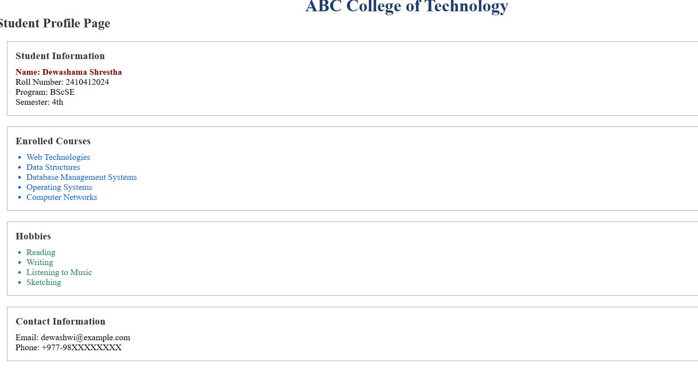
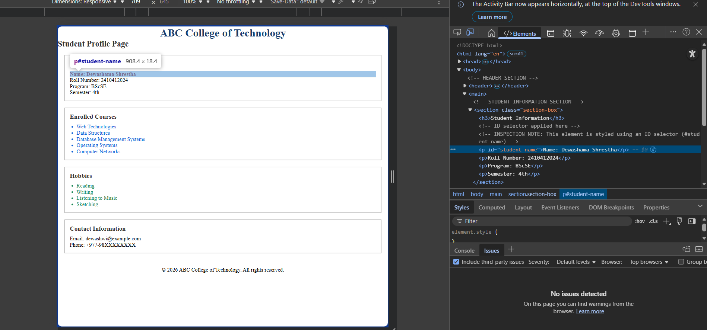
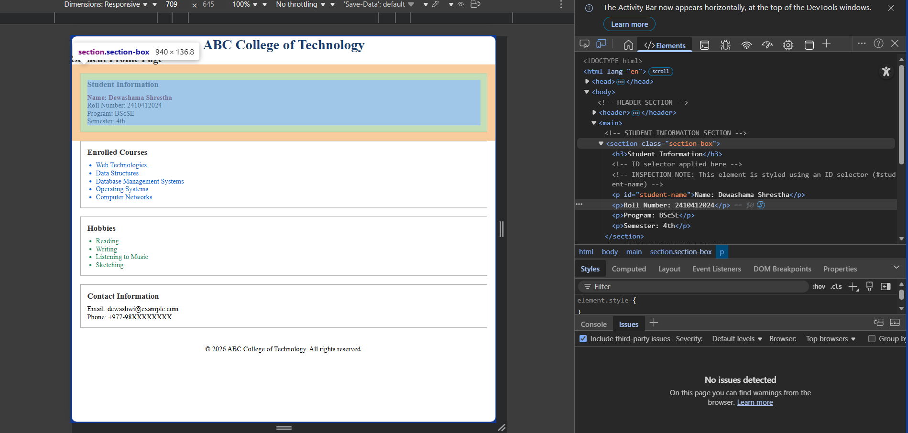

# Web Technologies and Platforms
## Lab Assignment – 02
### HTML and CSS Fundamentals Using Selectors

---

## 📌 Student Profile Web Page

This repository contains **Lab Assignment – 02**, which focuses on building a structured web page using **semantic HTML** and styling it using **basic CSS selectors**.
The assignment strictly follows the constraints provided, without using advanced CSS features or JavaScript.

---

## 🎯 Objectives of the Lab

The objectives of this lab are to:
- Create a well-structured HTML document
- Use semantic HTML elements correctly
- Apply CSS using:
  - Element selectors
  - Class selectors
  - ID selectors
  - Group selectors
  - Descendant selectors
  - Universal selector
- Maintain separation between content and presentation
- Inspect and analyze applied CSS using browser developer tools

---

## 🛠 Tools Used

- **Code Editor:** Visual Studio Code
- **Browser:** Google Chrome

---

## 📂 Folder Structure

student-profile/
-assets/
    -image- 1.png
    -image- 2.png
    -image- 3.png
-index.html
- style.css
- README.md

---

## 🧱 Technologies Used

- **HTML5** (Semantic structure)
- **CSS3** (Basic selectors only)

---

## 📄 Description of Files

### `index.html`
- Contains the structure of the Student Profile Web Page
- Uses semantic elements such as:
  - `<header>`
  - `<main>`
  - `<section>`
  - `<footer>`
- Includes student details, course list, hobbies, and contact information
- Contains HTML comments identifying:
  - One element styled using a **class selector**
  - One element styled using an **ID selector**

### `style.css`
- External stylesheet linked to `index.html`
- Uses the following selectors:
  - Universal selector (`*`)
  - Element selectors (`h1`, `p`)
  - Class selector (`.section-box`)
  - ID selector (`#student-name`)
  - Group selectors (`h2, h3`)
  - Descendant selectors (`.course-list li`, `.hobby-list li`)
- No inline or internal CSS is used

---

## 🔍 Inspection Task

Using the browser’s **Inspect Tool**:
- The **student name** element demonstrates styling via an **ID selector**
- The **section containers** demonstrate styling via a **class selector**

These elements are documented using HTML comments inside `index.html`.

---

## Constraints Followed

- No inline CSS
- No internal `<style>` tags
- No JavaScript
- No advanced CSS features (Flexbox, Grid, Media Queries)

---

## 📸 Screenshots Included

The following screenshots are included to demonstrate task completion:
1. Full view of the Student Profile Web Page

2. Inspect tool showing **ID selector** usage

3. Inspect tool showing **Class selector** usage

---

## ✅ Learning Outcome

This lab strengthened understanding of semantic HTML structure and the practical use of CSS selectors, forming a strong foundation for advanced styling techniques in future labs.

---

## 📜 Academic Integrity

This assignment is my original work and complies with the academic integrity policies of the institution.
