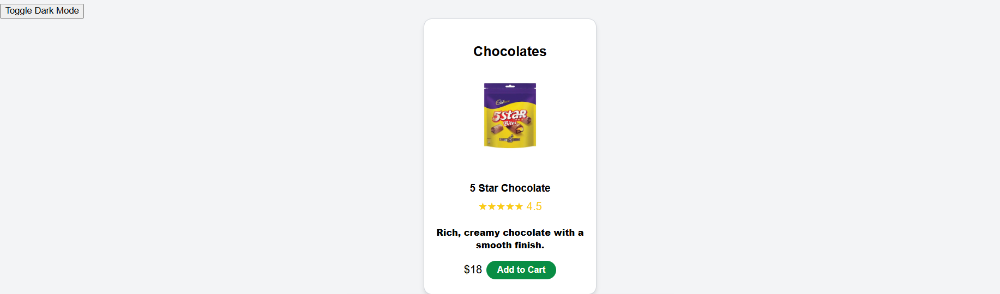
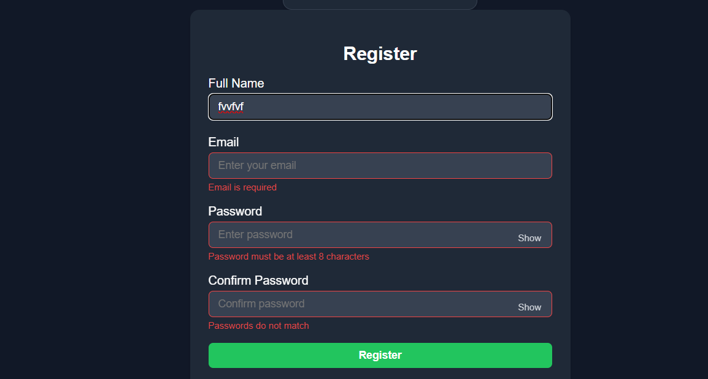
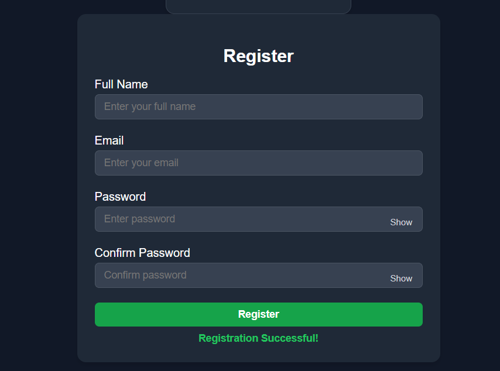
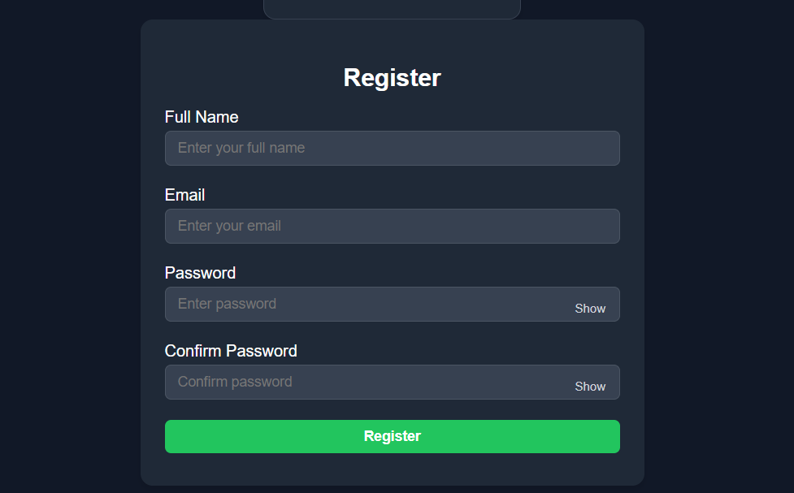
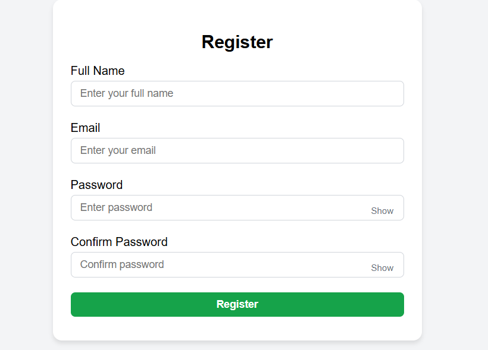

# Interactive Product Card and User Registration Form

## Project Description
This project demonstrates a responsive web page featuring a **Product Card** and a **User Registration Form** with interactive features. It is built using **HTML5, CSS3, and vanilla JavaScript** without any external libraries.

The main focus of this project is to apply web development concepts including:

- Form validation and error handling
- UI interactivity (Add-to-Cart messages, password visibility toggle)
- Dark/Light mode with theme persistence
- Responsive design for multiple screen sizes

---

## Features Implemented

### Product Card Component
- Displays product image, title, description, price, and an "Add to Cart" button.
- Shows a **success message** below the product card when the product is added to the cart.
- **Fallback image** displayed if product image fails to load.
- Fully compatible with **light and dark themes**.

### User Registration Form
- Collects **Full Name, Email, Password, and Confirm Password**.
- Client-side validation rules:
  - Full Name cannot be empty
  - Email must follow a valid email format
  - Password must be at least 8 characters
  - Password and Confirm Password must match
- Inline **error messages** displayed below each input field
- Invalid inputs highlighted with **red borders**
- Password fields have **show/hide toggle** functionality
- **Success message** displayed on valid form submission
- No page reload occurs on submission

### Dark/Light Mode
- Toggle button to switch between **dark mode** and **light mode**
- Theme affects **backgrounds, text, product cards, and form elements**

### Responsiveness
- Product cards are arranged in a **responsive grid**:
  - 1 column on mobile
  - 2 columns on tablets
  - 3 columns on desktop

---

## Folder Structure

project-folder/
│
├── index.html
├── css/
│ └── style.css
├── js/
│ └── script.js
└── README.md

---

## Instructions to Run the Project
1. Clone or download the repository to your local machine.
2. Open `index.html` in a web browser.
3. Test the following:
   - Click **Add to Cart** to see success messages.
   - Fill out the **registration form** with valid and invalid inputs to see validation errors and success message.
   - Toggle **dark/light mode** and refresh the page to see persistent theme.
   - Resize browser window to check **responsive layout**.

---

## Screenshots

### 1. Product Card (Light Mode)

### 2. Product Card (Dark Mode)

### 3. Form Validation Error

### 4. Form Success Message

### 5. Dark Mode

### 6. Light Mode

---

## Technologies Used
- **HTML5**: Structure of the page
- **CSS3**: Styling, dark/light themes, and responsive layout
- **JavaScript**: Interactivity, form validation, password toggle, Add-to-Cart messages, and theme persistence
