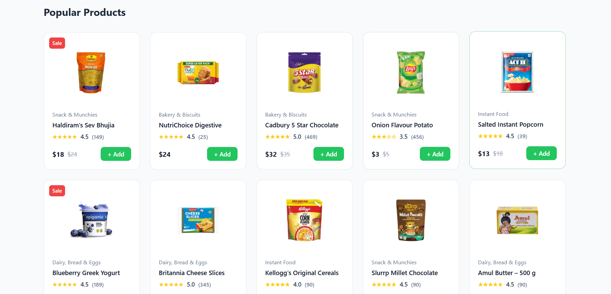

# FreshCart Clone

A responsive **FreshCart e-commerce website clone** built using **HTML, CSS, and Tailwind CSS**. This project replicates the look and feel of the FreshCart website, featuring a modern design, responsive layout, and interactive UI components.

---

## 🔗 Live Preview

> You can view the project locally by opening `index.html` in your browser.

---

## 🖥️ Project Screenshots





---

## Technologies Used

- **HTML5** – Semantic markup and structure
- **CSS3** – Custom styling
- **Tailwind CSS** – Utility-first framework for rapid styling
- **Feather Icons** – Icons for buttons and features
- **Responsive Design** – Fully responsive for mobile, tablet, and desktop

---

## Features

- **Responsive Navigation Bar** with search, location, and icons
- **Hero Banner** with animated background
- **Featured Categories Slider** with smooth scroll
- **Promo Banners** highlighting deals
- **Popular Products Section** with ratings, prices, and add-to-cart buttons
- **Daily Best Sells Section** with countdown timers
- **Features Section** showcasing key selling points
- **Footer** with company links, categories, and app download buttons
- Fully **mobile-friendly** and responsive across devices

---

## 📂 Project Structure

FreshCart-Clone/
│
├── assets/ # Images and icons
├── index.html # Main HTML file
├── styles.css # Custom CSS file
└── README.md # Project documentation


---

## ⚡ How to Run Locally

1. Clone the repository:

```bash
git clone https://github.com/yourusername/FreshCart-Clone.git
Navigate into the project folder:

cd FreshCart-Clone
Open index.html in your favorite browser.

📌 Reference
Original website: FreshCart

This project is a clone for educational purposes only.

📄 License
This project is for educational purposes and has no license for commercial use.